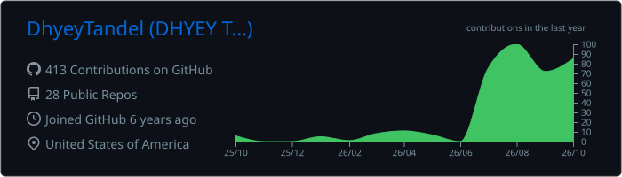
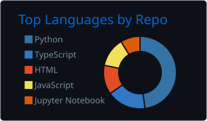
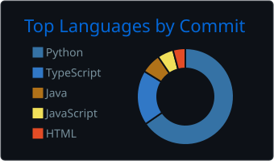

  

  

  
  
  
  

 

<table>
<tr>
<td width="58%" valign="top">

### 👋 About me

I like building the parts of a system that have to keep working when things go wrong: commit logs that survive torn writes, transport that survives packet loss, route planners that repair themselves when someone cancels.

Most of my repos are built from first principles and ship with the tests and benchmarks to back up what the README says.

🎯 **Open to** SDE, backend and ML engineering roles for 2027 
📍 Bengaluru, India

</td>
<td width="42%" valign="top">

### 💼 Experience

**Schneider Electric** 
Software Engineering Intern · May to Jul 2025

- **40M items/week** ingested into Azure, automated
- Reporting queries: **1 week → 12 hours**
- **40 API endpoints** tested, **20+ bugs** caught pre-release

</td>
</tr>
</table>

## 🚀 Featured work

<table>
<tr>
<td width="50%" valign="top">

#### ⚡ [FluxMQ](https://github.com/DhyeyTandel/FluxMQ)
Distributed message queue built from scratch: commit log, consumer groups, leader/follower replication.

**170,000+ msgs/sec** (425x) at **8.2 ms p99**, zero acknowledged-message loss when brokers are killed mid-stream.

  

</td>
<td width="50%" valign="top">

#### 🦅 [Kestrel](https://github.com/DhyeyTandel/kestrel)
OpenAI-compatible LLM inference server for Apple Silicon: Rust router over a Python MLX worker, binary IPC on a unix socket.

Admission control cuts **p99 time-to-first-token 2.6x** under overload; IPC overhead measured at **0.32% of a decode step**.

  

</td>
</tr>
<tr>
<td width="50%" valign="top">

#### 🚖 [Cabal](https://github.com/DhyeyTandel/Cabal)
Employee transport planner solving a heterogeneous-fleet vehicle routing problem with ride-time limits.

Heuristics **benchmarked against optimal**; repairs plans on cancellations without reshuffling everyone.

  

</td>
<td width="50%" valign="top">

#### 🌐 [MiniNET](https://github.com/DhyeyTandel/MiniNET)
Network stack simulator: Go-Back-N transport and Bellman-Ford routing over a deterministic lossy link.

Byte-identical transfers at **20% data + 10% ACK loss**; 3-hop topology converges in **2.12 s**.

 

</td>
</tr>
<tr>
<td width="50%" valign="top">

#### 📈 [NSE Arena](https://github.com/DhyeyTandel/NSE_ARENA)
Real-time paper-trading competitions on live NSE data, with seasonal leaderboards.

Custom **PineScript-lite engine** and **Gemini-powered agents** that trade alongside users.

  

</td>
<td width="50%" valign="top">

#### ♿ [Accessible Components](https://github.com/DhyeyTandel/a11y-hard-parts)
Eleven ARIA patterns people get wrong: focus traps, comboboxes, live regions, sliders.

Zero dependencies, **187 browser-run tests**, VoiceOver-verified. [Live demo →](https://dhyeytandel.github.io/a11y-hard-parts/)

 

</td>
</tr>
</table>

<b>More projects</b>

 

| Project | What it is | Stack |
| --- | --- | --- |
| [AI Shield](https://github.com/DhyeyTandel/AI-Shield) | ML intrusion detection and prevention on live packet capture, trained on CICIDS2017 | scikit-learn, Flask, Scapy |
| [Resume Screener](https://github.com/DhyeyTandel/Resume_Screener) | Human-in-the-loop resume screening with prompt-injection detection and an append-only audit log | FastAPI, React, Ollama |
| [Claude Usage Tracker](https://github.com/DhyeyTandel/Claude_Usage_Tracker) | Menu-bar widget for Claude Code limits and Anthropic API spend, with encrypted key storage | Electron, TypeScript |
| [AutoAssess](https://github.com/DhyeyTandel/autoassess) | Vehicle-damage segmentation and severity grading for insurance claims | YOLOv8-seg, PyTorch |
| [Cisco Demand Forecasting](https://github.com/DhyeyTandel/Cisco-Demand-Forecasting) | Ensemble model for product-demand forecasting | XGBoost, pandas |

## 🧰 Tech stack

   
  

## 📊 GitHub activity

  

  
  

  

  <picture>
    <source media="(prefers-color-scheme: dark)" srcset="https://raw.githubusercontent.com/DhyeyTandel/DhyeyTandel/output/github-snake-dark.svg"/>
    <source media="(prefers-color-scheme: light)" srcset="https://raw.githubusercontent.com/DhyeyTandel/DhyeyTandel/output/github-snake.svg"/>
    
  </picture>

  

